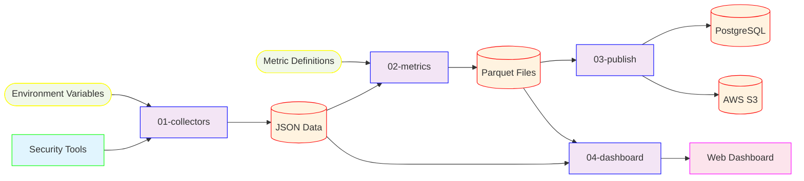

# Cyber Metrics Platform

A production-ready cybersecurity metrics platform that extracts raw data from security tools, generates compliance metrics, and provides interactive dashboards for visualization and analysis.

## 🚀 Quick Start

```bash
# Get started in 30 seconds
cd 04-dashboard
python generate_data.py    # Generates sample data and starts web server at http://localhost:8000
```

Open [http://localhost:8000](http://localhost:8000) to explore the interactive dashboard with sample security metrics.

## 📋 Platform Components

| Component | Purpose | Key Features |
|-----------|---------|--------------|
| **[01-collectors](01-collectors/)** | Data extraction from security tools | 15+ tool integrations, multi-storage backends, automatic retry |
| **[02-metrics](02-metrics/)** | Metric generation and processing | YAML-defined queries, compliance frameworks, historical trending |
| **[03-publish](03-publish/)** | Results publishing to external systems | Multiple formats, error recovery, monitoring |
| **[04-dashboard](04-dashboard/)** | Interactive web visualization | Executive overview, drill-down analysis, real-time filtering |

## 🏗️ Architecture



## 📊 Key Features

- **🔌 Multi-source Integration**: Extract data from 15+ security tools (CrowdStrike, Tenable, Okta, Snyk, etc.)
- **📈 Automated Metrics**: Generate 42+ compliance metrics using SQL queries with Jinja2 templating
- **🗄️ Flexible Storage**: Support for local files, PostgreSQL, AWS S3, and DuckDB
- **📱 Interactive Dashboard**: Executive overview, scorecards, and drill-down analysis
- **📋 Compliance Frameworks**: Built-in mapping to ISO 27001, CIS 8.1, NIST CSF, Essential 8
- **🔄 Production Ready**: Docker support, CI/CD integration, monitoring, and error recovery

## 🔄 Complete Data Flow

The platform follows a four-stage pipeline that transforms raw security tool data into actionable compliance metrics:

### Stage 1: Data Collection (01-collectors)
- **Input**: Security tool APIs (CrowdStrike, Tenable, Okta, Snyk, etc.)
- **Process**: Environment validation → API authentication → Data extraction → Normalization → Multi-storage
- **Output**: Standardized JSON files with metadata (timestamps, tenancy, UUIDs)

### Stage 2: Metric Generation (02-metrics)
- **Input**: Raw JSON data + YAML metric definitions
- **Process**: DuckDB queries with Jinja2 templating → Compliance calculations → Framework mapping
- **Output**: Parquet files with resource-level compliance scores and aggregated summaries

### Stage 3: Publishing (03-publish)
- **Input**: Parquet metric results
- **Process**: Format conversion → Multi-destination publishing → Error recovery
- **Output**: PostgreSQL tables, REST API calls, file exports, cloud storage

### Stage 4: Visualization (04-dashboard)
- **Input**: JSON data + Parquet metrics
- **Process**: Data aggregation → Interactive charts → Real-time filtering
- **Output**: Web dashboard with executive overview and drill-down analysis

## 🚀 Production Deployment

### Individual Components
```bash
# Data collection
cd 01-collectors && python wrapper.py

# Metric generation  
cd 02-metrics && python metrics.py

# Results publishing
cd 03-publish && python publish.py

# Dashboard server
cd 04-dashboard && python dashboard.py
```

### Docker Deployment
```bash
# Build and run dashboard
docker build -t cyber-metrics-dashboard 04-dashboard/
docker run -d -p 8000:8000 cyber-metrics-dashboard
```

### CI/CD Pipeline
```yaml
# Example GitHub Actions workflow
name: Cyber Metrics Pipeline
on:
  schedule:
    - cron: '0 */6 * * *'  # Every 6 hours
jobs:
  metrics:
    runs-on: ubuntu-latest
    steps:
      - name: Collect Data
        run: cd 01-collectors && python wrapper.py
      - name: Generate Metrics
        run: cd 02-metrics && python metrics.py
      - name: Publish Results
        run: cd 03-publish && python publish.py
      - name: Deploy Dashboard
        run: cd 04-dashboard && python dashboard.py
```

## 📖 Documentation

### Getting Started
- **[Data Collectors](01-collectors/)** - Data collection setup and configuration
- **[Metrics Engine](02-metrics/)** - Metric generation and SQL queries

### Component Documentation
- **[Data Collectors](01-collectors/)** - Security tool integrations and setup
- **[Metrics Engine](02-metrics/)** - Metric definitions and SQL queries  
- **[Results Publisher](03-publish/)** - Publishing to external systems
- **[Interactive Dashboard](04-dashboard/)** - Web dashboard deployment

### Reference
- **[Supported Collectors](00-docs/collectors.md)** - Complete list of security tool integrations
- **[Available Metrics](00-docs/metrics.md)** - Catalog of compliance metrics
- **[Writing Collectors](00-docs/writing-a-collector.md)** - Developer guide

## 🛠️ Technology Stack

- **Backend**: Python 3.9+, DuckDB, Pandas
- **Frontend**: Vanilla JavaScript, Chart.js, Bootstrap 5
- **Storage**: Local files, PostgreSQL, AWS S3, DuckDB
- **Deployment**: Docker, Python HTTP server
- **APIs**: REST integrations for 15+ security tools

## 🔗 Integration Ecosystem

The platform integrates with major security tools including:

- **Endpoint Security**: CrowdStrike Falcon, Microsoft Defender
- **Vulnerability Management**: Tenable.io, Qualys, Rapid7
- **Identity & Access**: Okta, Azure AD, AWS IAM  
- **Application Security**: Snyk, SonarQube, Veracode
- **Cloud Security**: AWS Security Hub, Azure Security Center
- **Network Security**: Palo Alto, Fortinet, Cisco

## 📈 Compliance Coverage

- **ISO 27001**: 25+ controls mapped
- **CIS Controls v8.1**: 42 of 153 controls (27.5% coverage)
- **NIST Cybersecurity Framework**: Core functions coverage
- **Essential 8**: Australian government security controls

## 📞 Support

- **Issues**: [GitHub Issues](https://github.com/your-org/cyber-metrics/issues)
- **Documentation**: Complete guides in each component directory
- **Contributing**: See individual component READMEs for development guides

---

**⭐ Star this repository** if you find it useful for your cybersecurity metrics needs!

