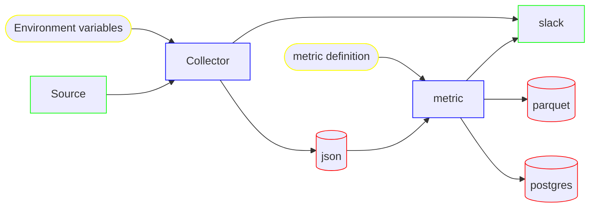

# cyber-metrics

The cyber-metrics project is responsible for extracting raw data from data sources, and generating security metrics.  Once the metrics are produced, the data is sent to the [Cyber Dashboard](https://github.com/massyn/cyber-dashboard-flask).

## Collectors

* [How to run an Extraction](00-docs/how-to-run-an-extraction.md)
* [Writing a collector](00-docs/writing-a-collector.md)
* [List of Collectors](00-docs/collectors.md)

## Metrics

* [List of Metrics](00-docs/metrics.md)

## Overview

The cyber-metrics program is responsible for generating the cyber metrics used by the dashboard tooling.  It has the following key requirements

* Download the raw data from the source systems (collectors)
* Generate pre-defined metrics based off yaml configuration
* Upload the generated metrics to a destination (postgres, or the dashboard API)

### Architecture

