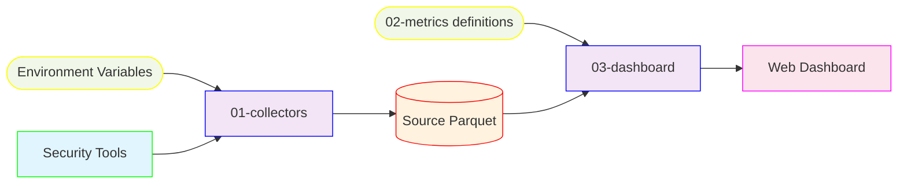

# Cyber Metrics Platform

A cybersecurity metrics platform that extracts raw data from security tools and turns it into compliance metrics mapped to common frameworks.

## 🚀 Quick Start

```bash
pip install -r requirements.txt
posturecollect --output data/source                                # collect from every configured source
posturecollect --include cve_db.cve_summary --output data/source   # no-auth source used by the vm_* metrics
cd 03-dashboard && python app.py                                   # run the metrics and view them at http://127.0.0.1:5000
```

## 📋 Platform Components

| Component | Purpose | Key Features |
|-----------|---------|--------------|
| **[01-collectors](01-collectors/)** | Data extraction from security tools | Powered by [posture](https://github.com/massyn/posture) — one `posturecollect` command writes every table to Parquet |
| **[02-metrics](02-metrics/)** | Metric definitions | YAML-defined SQL queries, SLOs, compliance framework mappings |
| **[03-dashboard](03-dashboard/)** | Metric engine and web dashboard | Runs the metrics against the collected data; Flask app showing current scores and resource-level detail, with filters |

## 🏗️ Architecture


```mermaid
graph LR
    source[Security Tools]:::external
    collector[01-collectors]:::component
    dashboard[03-dashboard]:::component

    env([Environment Variables]):::config
    yaml([02-metrics definitions]):::config
    raw[(Source Parquet)]:::data
    web[Web Dashboard]:::output

    env --> collector
    source --> collector
    collector --> raw

    yaml --> dashboard
    raw --> dashboard
    dashboard --> web

    classDef external stroke:#0f0,fill:#e1f5fe
    classDef component stroke:#00f,fill:#f3e5f5
    classDef data stroke:#f00,fill:#fff3e0
    classDef config stroke:#ff0,fill:#f1f8e9
    classDef output stroke:#f0f,fill:#fce4ec
```

## 📊 Key Features

- **🔌 Multi-source Integration**: Extract data from every security tool supported by [posture](https://github.com/massyn/posture)
- **📈 Automated Metrics**: 37 metric definitions written as SQL queries with Jinja2 templating
- **📱 Dashboard**: Scorecard of current metric scores against their SLOs, with resource-level detail and filters
- **📋 Compliance Frameworks**: Built-in mapping to ISO 27001, CIS 8.1, NIST CSF, Essential 8

## 🔄 Complete Data Flow

The platform follows a two-stage pipeline that transforms raw security tool data into compliance metrics:

### Stage 1: Data Collection (01-collectors)
- **Input**: Security tool APIs, via [posture](https://github.com/massyn/posture)
- **Process**: `posturecollect` collects every source whose credentials are set in the environment
- **Output**: One Parquet file per table in `data/source/` (`<source>_<resource>.parquet`)

### Stage 2: Metrics and Dashboard (02-metrics, 03-dashboard)
- **Input**: Source Parquet files + YAML metric definitions from `02-metrics/`
- **Process**: The dashboard runs each metric's DuckDB queries → Compliance scores → SLO status
- **Output**: A web scorecard of current scores, with each metric's resource-level detail

## 🚀 Running

```bash
# Data collection (from the repo root)
posturecollect --output data/source
posturecollect --include cve_db.cve_summary --output data/source   # no-auth source used by the vm_* metrics

# Metrics and dashboard
cd 03-dashboard && python app.py
```

`run.sh` does both: it collects from every configured source plus the no-auth `cve_db`, `macadmins` and `endoflife` sources, then starts the dashboard. To keep the data current while the dashboard runs, schedule just the `posturecollect` commands (e.g. with cron); the dashboard re-runs the metrics automatically when the data changes.

## 📖 Documentation

### Component Documentation
- **[Data Collectors](01-collectors/)** - Collecting data with posture
- **[Metric Definitions](02-metrics/)** - Writing metrics and their SQL queries
- **[Dashboard](03-dashboard/)** - Running the metrics and viewing them in a browser

### Reference
- **[Data Sources Schema](schema.md)** - Tables and fields used by the current metrics
- **[Supported Sources](https://github.com/massyn/posture/blob/main/docs/index.md)** - Security tools supported by posture
- **[Available Metrics](00-docs/metrics.md)** - Catalog of compliance metrics

## 🛠️ Technology Stack

- **Collection**: [posture](https://github.com/massyn/posture)
- **Metrics**: Python 3.10+, DuckDB, Pandas, Jinja2
- **Dashboard**: Flask, Bootstrap 5
- **Storage**: Local Parquet files

## 📈 Compliance Coverage

Distinct controls mapped by the current metrics, out of those listed in `99-templates/framework.csv`:

- **ISO 27001:2022**: 12 of 93 controls
- **CIS Controls v8.1**: 29 of 153 safeguards (19%)
- **NIST CSF v2.0**: 15 of 106 subcategories
- **Essential 8**: 13 ISM controls

## 📞 Support

- **Issues**: [GitHub Issues](https://github.com/massyn/cyber-metrics/issues)
- **Documentation**: Complete guides in each component directory
- **Contributing**: See individual component READMEs for development guides

---

**⭐ Star this repository** if you find it useful for your cybersecurity metrics needs!
